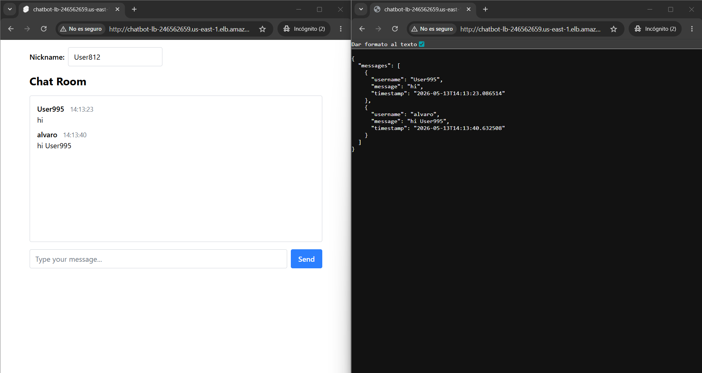
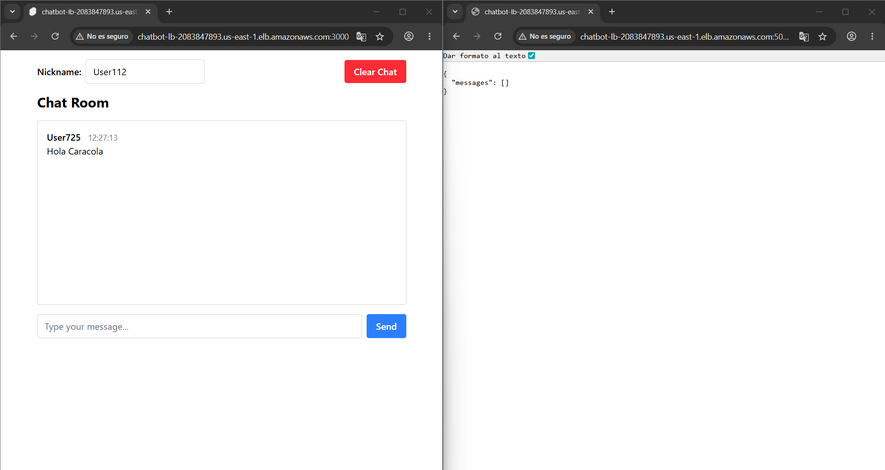
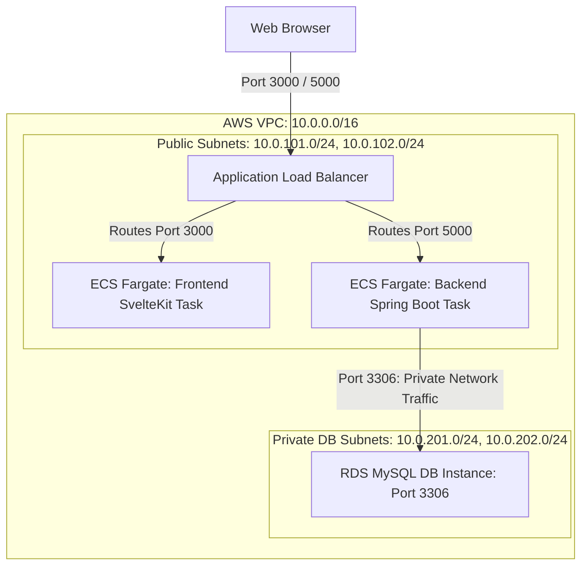
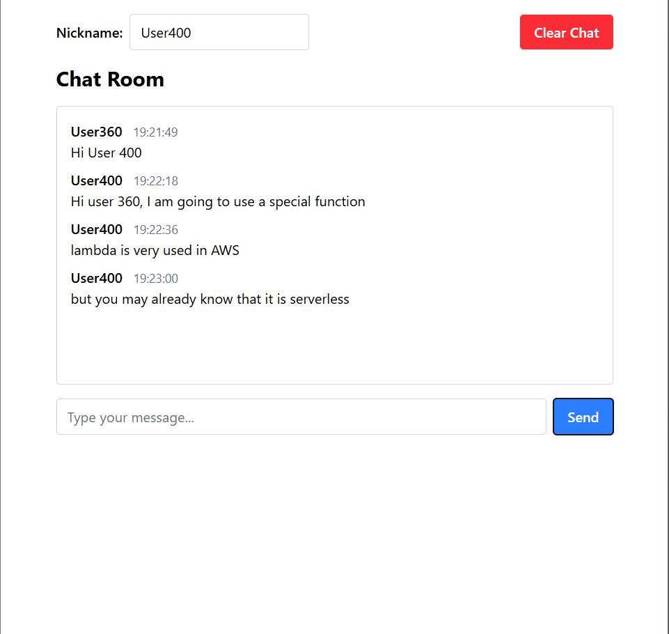
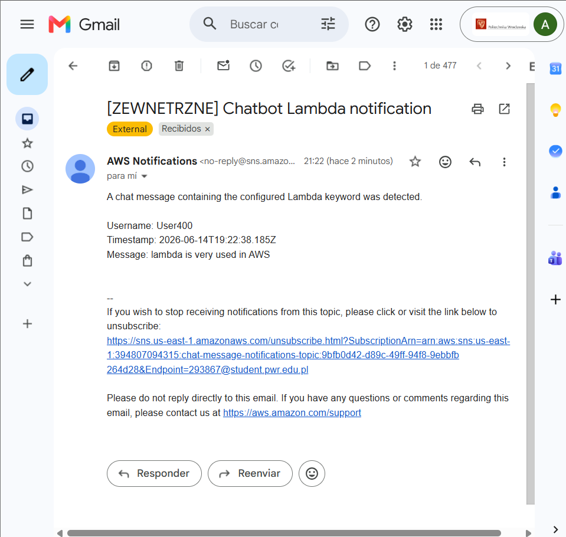

[](https://classroom.github.com/open-in-codespaces?assignment_repo_id=23848151)
# Lab9 Report — ECS Fargate Deployment with Load Balancer

Authors:
- Álvaro Puebla Ruisánchez - 293867
- Enrique Ferrera Aznar - 293873

---

## 1. Configuration

### 1.1 Infrastructure Overview

The Chatbot application (Spring Boot backend + SvelteKit frontend) is deployed to **AWS ECS Fargate** using **Terraform**, following the demo `main.tf` pattern with an **Application Load Balancer (ALB)**.

All infrastructure is defined in a single file: [`Chatbot/main.tf`](Chatbot/main.tf).

### 1.2 AWS Resources Created

| Resource | Name / ID | Details |
|----------|-----------|---------|
| **Region** | `us-east-1` | N. Virginia |
| **VPC** | `ecs-chatbot` | CIDR `10.0.0.0/16`, 2 public subnets across `us-east-1a` and `us-east-1b` |
| **Security Group** | `chatbot_allow_http` | Inbound: ports 3000 (frontend) and 5000 (backend). Outbound: all |
| **ECR Repository (backend)** | `chatbot-backend` | Stores the Spring Boot Docker image |
| **ECR Repository (frontend)** | `chatbot-frontend` | Stores the SvelteKit Docker image |
| **ECS Cluster** | `ecs_chatbot` | Single cluster for both services |
| **ECS Task (backend)** | `ecs_task_chatbot_backend` | Fargate, 512 CPU / 1024 MiB, port 5000 |
| **ECS Task (frontend)** | `ecs_task_chatbot_frontend` | Fargate, 512 CPU / 1024 MiB, port 3000 |
| **ECS Service (backend)** | `ecs_svc_chatbot_backend` | 1 replica, attached to backend target group |
| **ECS Service (frontend)** | `ecs_svc_chatbot_frontend` | 1 replica, attached to frontend target group |
| **ALB** | `chatbot-lb` | Application Load Balancer, spans both public subnets |
| **Target Group (backend)** | `chatbot-backend-tg` | Port 5000, health check on `/chat/all?username=healthcheck` |
| **Target Group (frontend)** | `chatbot-frontend-tg` | Port 3000, health check on `/` |
| **Listener (backend)** | Port 5000 | Forwards to backend target group |
| **Listener (frontend)** | Port 3000 | Forwards to frontend target group |

### 1.3 Key Design Decisions

- **Single ALB with two listeners**: Port 3000 serves the frontend, port 5000 serves the backend API — mirrors the local Docker Compose port mapping.
- **Dynamic backend URL**: The frontend uses SvelteKit's `$env/dynamic/public` to read `PUBLIC_API_BASE_URL` at runtime. The ECS task definition sets this to `http://<ALB_DNS>:5000/`, resolved by Terraform via `aws_lb.app_lb.dns_name`.
- **LabRole**: Both task and execution roles use the AWS Academy `LabRole`.

### 1.4 Deployment Commands

```bash
# 1. Initialize Terraform
cd Chatbot
terraform init

# 2. Apply infrastructure
terraform apply

# 3. Authenticate Docker to ECR
aws ecr get-login-password --region us-east-1 | docker login --username AWS --password-stdin 394807094315.dkr.ecr.us-east-1.amazonaws.com

# 4. Build and push backend
docker build -t chatbot-backend ./backend
docker tag chatbot-backend:latest 394807094315.dkr.ecr.us-east-1.amazonaws.com/chatbot-backend:latest
docker push 394807094315.dkr.ecr.us-east-1.amazonaws.com/chatbot-backend:latest

# 5. Build and push frontend
docker build --build-arg PUBLIC_API_BASE_URL=http://placeholder/ -t chatbot-frontend ./frontend
docker tag chatbot-frontend:latest 394807094315.dkr.ecr.us-east-1.amazonaws.com/chatbot-frontend:latest
docker push 394807094315.dkr.ecr.us-east-1.amazonaws.com/chatbot-frontend:latest

# 6. Force ECS services to pull new images
aws ecs update-service --cluster ecs_chatbot --service ecs_svc_chatbot_backend --force-new-deployment --region us-east-1
aws ecs update-service --cluster ecs_chatbot --service ecs_svc_chatbot_frontend --force-new-deployment --region us-east-1
```

---

## 2. Getting Started from Scratch

To deploy the entire environment from a clean state, follow these steps in the `Chatbot` folder:

### Step 1: Infrastructure Deployment
Run Terraform to create the VPC, ECR repositories, ECS cluster, and Load Balancer. This will also generate a `deploy.sh` script tailored to your new infrastructure.

```powershell
cd Chatbot
terraform init
terraform apply -auto-approve
```

### Step 2: Application Deployment (ECR Build & Push)
Run the generated deployment script to build the images with Podman and push them to AWS.

```powershell
# On Windows (PowerShell):
.\deploy.ps1

# On Linux/macOS or Git Bash:
sh deploy.sh
```

---

## 3. Verification of the solution

*Once the deployment is complete, the application is accessible at the following URLs (provided by Terraform outputs):*

- **Frontend**: `http://<ALB_DNS>:3000`
- **Backend API**: `http://<ALB_DNS>:5000/chat/all?username=test`

### Application in Action

#### Lab 9 (ECS Fargate + SvelteKit + Spring Boot Backend)


#### Lab 11 (ECS Fargate + Spring Boot + Private RDS MySQL Database + Clear Chat)


---

## 4. Feedback and Reflections

### What do you think about using Terraform to build cloud configuration?
Terraform provides an incredibly declarative and reproducible way to manage cloud infrastructure. In Lab 11, extending our setup to support ECR image building separately from deploying ECS resources (ALB, private MySQL RDS instances) was simple and clean. Having isolated state files makes it much safer to run schema operations or update credentials without touching the core load-balanced ECS service logic.

### Did you encounter any obstacles? Was there something difficult for you?
- **PowerShell Encoding**: When piping the ECR credentials password (`aws ecr get-login-password | podman login`), PowerShell automatically uses UTF-16 encoding with trailing newlines. This corrupted the ECR token and resulted in a `403 Forbidden` error. We resolved this by bypassing the PowerShell piping system and calling `cmd.exe /c` to run the native pipe.
- **Private Subnets & VPC Route Tables**: Creating database subnets without a private routing configuration resulted in route-table association failures inside the Terraform VPC module. This was fixed by enabling `create_database_subnet_route_table = true`.

---

## 5. Lab 11: RDS MySQL Migration & Deployment Architecture

### 5.1 Graphical Scheme of the Configuration
Here is the structural mapping of our AWS architecture, highlighting the separation of public ingress traffic (ALB, ECS Fargate) from the isolated private database layer:



### 5.2 Scheme of the Database
The application database content is defined in `Chatbot/schema.sql`. It establishes the schema structure for permanent chat message storage:

```sql
CREATE DATABASE IF NOT EXISTS `chatbotdb`;
USE `chatbotdb`;

CREATE TABLE IF NOT EXISTS `chat_message` (
  `id` BIGINT NOT NULL AUTO_INCREMENT,
  `username` VARCHAR(255) NOT NULL,
  `message` TEXT NOT NULL,
  `timestamp` DATETIME(6) NOT NULL,
  PRIMARY KEY (`id`)
) ENGINE=InnoDB DEFAULT CHARSET=utf8mb4 COLLATE=utf8mb4_unicode_ci;
```

### 5.3 How the Database Content Changes
Database mutations and retrievals occur via Spring Boot Rest endpoints, utilizing the Spring Data JPA layer:

1. **Insert / Store (POST `/chat`)**
   When a user posts a message, `ChatServiceImpl.createLiveEvent` receives the payload, creates a `ChatMessage` entity, and saves it. Hibernate automatically executes an `INSERT INTO chat_message` command.
2. **Retrieve / Load (GET `/chat/all` or GET `/chat?after=...`)**
   Frontend client calls fetch all historical messages or poll for new messages since a given timestamp. The repository uses `findAll()` or `findByTimestampAfter(after)` to run the corresponding `SELECT` queries.
3. **Delete / Clear (DELETE `/chat`)**
   We added a new `DELETE` REST endpoint. Clicking the **Clear Chat** button on the frontend triggers an API request to the backend's `@DeleteMapping` endpoint which executes `chatMessageRepository.deleteAll()`. Hibernate triggers `DELETE FROM chat_message`.

### 5.4 Key Infrastructure Excerpts

- **Isolated Private DB Security**: 
  The database is entirely cut off from public internet routes and only accepts SQL traffic originating from the security group of the ECS Fargate Tasks:
  ```hcl
  resource "aws_security_group" "allow_db" {
    name        = "allow_db"
    description = "Allow inbound MySQL traffic from backend"
    vpc_id      = module.my_vpc.vpc_id
  }
  
  resource "aws_vpc_security_group_ingress_rule" "allow_mysql" {
    security_group_id = aws_security_group.allow_db.id
    referenced_security_group_id = aws_security_group.allow_http.id # ECS Tasks
    from_port         = 3306
    to_port           = 3306
    ip_protocol       = "tcp"
  }
  ```

- **ECS Task Database Injections**:
  The environment configurations (`DB_HOST`, `DB_NAME`, `DB_USERNAME`, `DB_PASSWORD`) are injected into the ECS task definitions so that the Spring Boot backend can cleanly extract them and configure the JDBC connection pools at boot time.

- **Clear Chat Frontend Control**:
  In `+page.svelte`, we added a **Clear Chat** button next to the user nickname, triggering the endpoint:
  ```typescript
  const clearChat = async () => {
    try {
      await api.delete('/chat');
      messages = [];
    } catch (error) {
      console.error('Error clearing chat:', error);
    }
  };
  ```

---

## 6. Lab 12: CloudWatch Alarms & Monitoring

This lab configures AWS CloudWatch and EventBridge to monitor the ECS cluster and automatically send email alerts using an Amazon SNS topic.

1. **CPU & Memory Monitoring**: CloudWatch Container Insights has been enabled for the ECS cluster (`ecs_chatbot`), automatically providing deep visibility into the CPU and memory usage of all running containers.
2. **CPU High Utilization Alarm**: An SNS topic (`ecs-alerts-topic`) and an email subscription were created. A CloudWatch Metric Alarm (`ecs-cpu-high-alarm`) is configured to track the `CPUUtilization` metric in the `AWS/ECS` namespace. It triggers an alert and sends an email via SNS whenever the average CPU usage goes above a configurable threshold. This threshold is exposed as a Terraform Input Variable (`cpu_threshold`).
3. **Tasks Stopped Event Alert**: An Amazon EventBridge Rule (`ecs-task-stopped-rule`) was set up to capture `ECS Task State Change` events. When any task in the account transitions to the `STOPPED` state, the event is immediately captured and routed to the SNS topic, notifying the administrator via email.

---

## 7. Declaration of Authors' Contributions

All tasks were co-authored, peer-reviewed, and tested locally and on the Cloud environment by:
- **Álvaro Puebla Ruisánchez** (293867) — Cloud architecture design, Terraform configurations, ECR isolation, database private subnetting, scripting issues.
- **Enrique Ferrera Aznar** (293873) — Spring Boot backend development, SvelteKit frontend enhancements, REST API modifications, JDBC data mapping, validation.
---

## 8. Lab 13: Lambda notification from the chat frontend

This assignment extends the existing chat application without creating a new repository. The same ECS, ALB, RDS and CloudWatch configuration remains unchanged, and only the required Lambda/SNS notification functionality was added.

### Trigger word

The configured trigger word is:

```text
lambda
```

When a user sends a chat message containing this word, the frontend sends the complete message payload to an AWS Lambda function before saving the message in the normal chat backend. The payload contains:

- `username`
- `message`
- `timestamp`

### AWS Lambda and SNS configuration

The Terraform configuration creates the following new resources:

- `aws_lambda_function.chat_message_notifier` — Python Lambda function that receives the chat message payload.
- `aws_lambda_function_url.chat_message_notifier_url` — public Function URL used by the frontend to invoke the Lambda function.
- `aws_sns_topic.chat_message_notifications` — SNS topic used for chat keyword notifications.
- `aws_sns_topic_subscription.chat_message_notifications_email` — e-mail subscription for the notification topic.
- `data.archive_file.chat_message_notifier_zip` — packages the Lambda source code automatically from `lambda/message_notifier`.

The Lambda function is published with `publish = true`, and the frontend receives the Function URL through the ECS environment variable:

```text
PUBLIC_LAMBDA_FUNCTION_URL
```

The trigger word is also exposed through:

```text
PUBLIC_LAMBDA_KEYWORD
```

### Frontend change

The chat frontend now checks the message content in `frontend/src/routes/+page.svelte`. If the message contains the configured keyword, it sends this JSON payload to Lambda:

```json
{
  "username": "User123",
  "message": "example message containing lambda",
  "timestamp": "2026-06-11T10:00:00.000Z"
}
```

The Lambda call is intentionally isolated from the normal chat save operation. If the notification request fails, the chat message can still be sent to the backend.

### E-mail notification content

The Lambda function publishes an SNS message containing the username, timestamp and full chat message. After running `terraform apply`, the e-mail subscription must be confirmed from the mailbox configured in `var.alert_email`.

### Application in Action

#### Lab 13 (Lambda Function + SNS)
The word "lambda" is mentioned

And email is received
