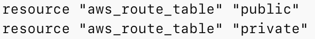
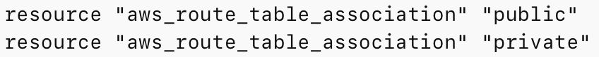
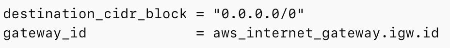
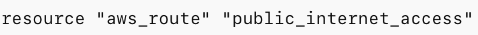
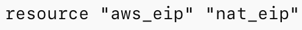
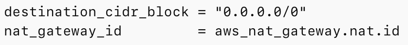
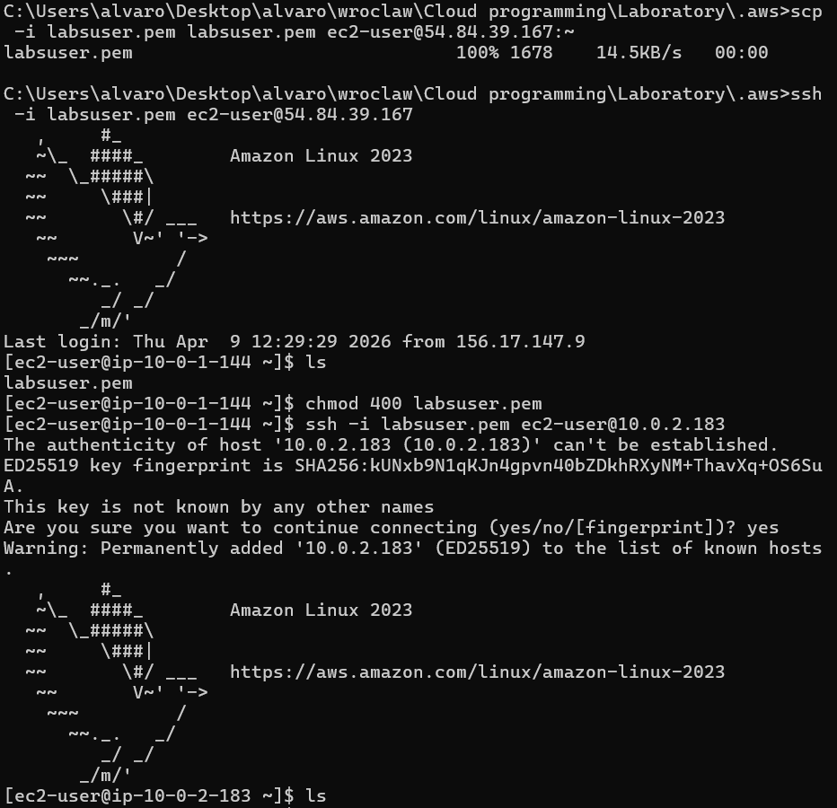
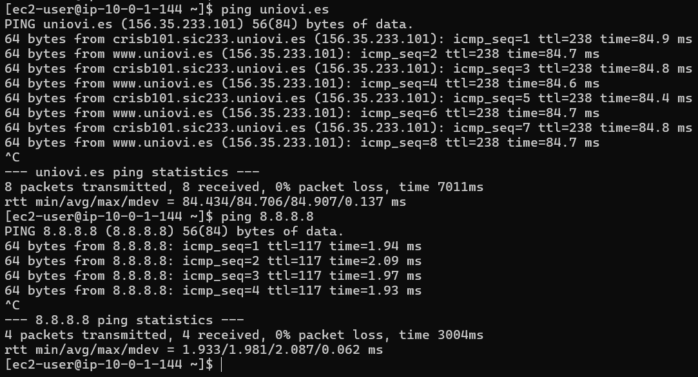
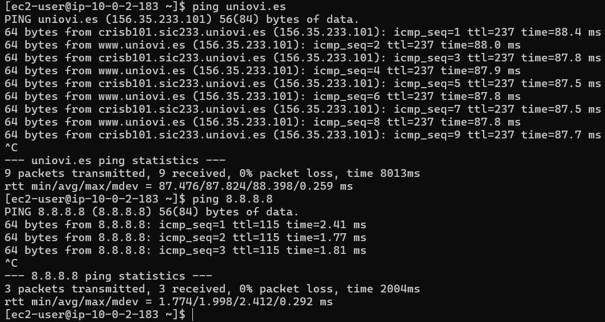

# Lab6 Report

Authors:
- Álvaro Puebla Ruisánchez - 293867
- Enrique Ferrer Aznar - 293837

## Configuration

Exercise 1

1 - VPC creation

The first step consists of creating the VPC. VPC is a private virtual network where all AWS resources will be deployed.The VPC was configured with CIDR block 10.0.0.0/16. This means that the whole private address may be divided into smaller subnetworks. In addition DNS support and DNS hostnames were enabled

2 - Public subnet

After creating the VPC, a public subnet was created inside it. The public subnet uses the CIDR block 10.0.1.0/24 and is allocated in availability zone us-east-1a.

This subnet is called public because it is intended for resources that can be reachable from the Internet. In the configuration, the option:

was enabled. That means that if an EC2 instance is launched in this subnet, AWS can automatically assign it a public IP address.

3 - Private subnet

It was also created on the same VPC, using CIDR block 10.0.2.0/24 and the same availability zone. This subnet is designed for resources that should not be directly accessible from the Internet. For this reason, the configuration includes:

This prevents AWS from automatically assigning public IP addresses to instances launched in this subnet.

The Terraform resource used was:

4 - Route tables

To control the network traffic of each subnet, two different route tables were created:
one for the public subnet
one for the private subnet

A route table contains the routing rules that define where network packets should be sent. At the first step, we have created the route tables but Internet routes are not added yet.

Resources used were:

5 - Route table associations

Finally, each route table must be associated with the correspondent subnet.

the public route table was associated with the public subnet
the private route table was associated with the private subnet 

That is a relevant step because it is not enough when we create the proper route tables. AWS needs to know which subnet uses which route table.

Resources used were:

At the end of Exercise 1, the internal network layout was already defined: one VPC containing one public subnet and one private subnet, each one with its own routing table. This matches the first part of the lab requirements.

Exercise 2

1 - Internet gateway
An Internet Gateway was created and attached to the VPC.

The Internet Gateway is the component that allows communication between the VPC and the public Internet. Without it, even instances with public IP addresses would not be able to send or receive traffic from outside the VPC.
The Terraform resource used was:

This resource was linked directly to the VPC using:

2 - Default route for the public subnet
Once the Internet Gateway was created, a default route was added to the public route table:

The CIDR block 0.0.0.0/0 means “all destinations”. Therefore, this rule tells AWS that any traffic going outside the local network should be sent to the Internet Gateway.
This is what makes the public subnet truly public. Without this route, the subnet would still exist, but it would not have Internet connectivity.
The Terraform resource used was:

3 - Elastic IP for NAT gateway
Before creating the NAT Gateway, it was necessary to allocate an Elastic IP.
A NAT Gateway needs a public IP address so it can communicate with the Internet on behalf of the private subnet. An Elastic IP is a static public IP managed by AWS.
The Terraform resource used was:

This Elastic IP is not directly used by instances. Instead, it is assigned to the NAT Gateway.

4 - NAT gateway for public subnet
Next, I created a NAT Gateway and placed it in the public subnet. First, I allocated an Elastic IP, because the NAT Gateway needs a public address. Then, I connected that Elastic IP to the NAT Gateway and deployed it in the public subnet. In this way, the NAT Gateway becomes part of the network configuration and can later be referenced from the private route table.
The Terraform resource used was:

Its main configuration was:
allocation_id = aws_eip.nat_eip.id
subnet_id = aws_subnet.public.id

That means that the NAT gateway uses the elastic IP and it is deployed inside the public subnet.
A dependency on the Internet Gateway was also added:

This ensures that Terraform creates the Internet Gateway first, avoiding deployment errors.

5 - Default route for the private subnet

Finally, a default route was added to the private route table, but instead of pointing to the Internet Gateway, it points to the NAT Gateway:

This route allows instances in the private subnet to initiate outbound Internet communication through the NAT Gateway.
This is the most important difference between both subnets:
- the public subnet sends Internet traffic directly to the Internet Gateway,
- the private subnet sends Internet traffic to the NAT Gateway, which then forwards it to the Internet.

Because of this, the private subnet does not expose its instances directly to the outside world
The Terraform resource used was:

This completes the second part of the lab requirements.

Exercise 3

In this part of the lab, I created two EC2 instances placed in different subnets in order to separate public and private access.

First, I created one EC2 instance in the **public subnet**. This instance was configured with a **public IP address**, so it can be reached directly from outside the VPC. This machine is used as the entry point for SSH access and for connectivity testing.

Then, I created a **Security Group** for this first instance. In this Security Group, I added an inbound rule that allows **SSH traffic on port 22 from any IP address (`0.0.0.0/0`)**. This makes it possible to connect to the public instance from my local machine.

After that, I created a second EC2 instance in the **private subnet**. Unlike the first one, this instance does not need direct public access, so it remains inside the private part of the network.

For the second instance, I created another **Security Group**. Instead of allowing SSH from anywhere, this Security Group only allows **SSH access from the Security Group assigned to the first EC2 instance**. This means that the private instance can only be reached from the public instance, which makes the configuration more secure.

This design creates a simple two-level access model:
- the **public EC2 instance** acts as a jump host / bastion host,
- the **private EC2 instance** is protected and can only be accessed from inside the VPC through the first instance.

This configuration follows the requirements of the exercise and is consistent with the public/private subnet architecture created in the previous steps.

## Verification of the solution

Copy your private key to the first EC2 instance. Connect using SSH from the first to the second instance.

By running the commands:
> scp -i labsuser.pem labsuser.pem ec2-user@54.84.39.167:~
Where 54.84.39.167 is the Public IP of Public VM1

We connect by:
> ssh -i labsuser.pem ec2-user@54.84.39.167

Enable permission:
> chmod 400 labsuser.pem

And by running:
> ssh -i labsuser.pem ec2-user@10.0.2.183
Where 10.0.2.183 is the Private IP of Private VM2

We get the access to the VM2

Here are the pings from each machine to internet:
Public VM:

Private VM:

## Your feedback and reflections

What do you think about using Terraform to build cloud configuration.

Did you encounter any obstacles? Was there something difficult for you?
