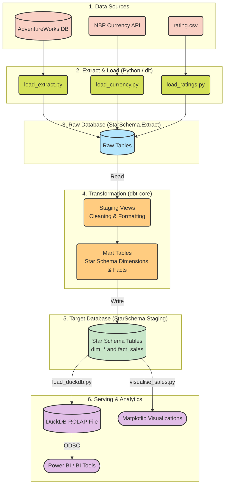

# Architecture of the ELT Data Pipeline (Lab 6)

This document outlines the end-to-end flow of how data is extracted, transformed, and served within your application.

## High-Level Architecture Diagram

---

## 1. Import (Extract & Load)
The pipeline starts with the extraction layer managed by **`dlt` (data load tool)**. Instead of doing heavy processing in Python, we extract data "as-is" and load it into a dedicated raw schema.
* **`load_extract.py`**: Connects directly to the `AdventureWorks` database and pulls operational tables (like `Product`, `SalesOrderHeader`, `Person`, etc.).
* **`load_currency.py`**: Makes an HTTP request to the Polish National Bank (NBP) API to fetch historical USD-to-PLN exchange rates, and forward-fills weekends.
* **`load_ratings.py`**: Reads `rating.csv` from the local disk.

**Destination:** All of this raw data is dumped into the `Extract` schema inside your `StarSchema` SQL Server database.

## 2. Transformation
Once the raw data is physically inside the SQL Server, **`dbt` (data build tool)** takes over. Because it's an ELT (Extract-Load-Transform) pipeline, dbt never moves data out of the database; it just compiles SQL `SELECT` statements and sends them to the SQL Server to execute.
* **Staging Models (`models/staging/stg_*.sql`)**: Built as lightweight SQL Views. This step handles renaming columns, standardising units (grams to kilograms), handling NULLs, and joining simple parent-child tables.
* **Mart Models (`models/marts/*.sql`)**: Built as physical SQL Tables. This forms your final Star Schema. It generates surrogate keys (like `sales_fact_key`), the contiguous calendar spine (`dim_order_date`), and calculates final business logic like currency conversion (`line_total_pln`) and trend flags (`Rising`/`Falling`).

**Destination:** The finalized, clean star schema tables are materialized into the `Staging` schema of your `StarSchema` database.

## 3. Serve (Analytics & Visualisation)
With the Star Schema fully processed, the data is ready for fast analytical querying and visualization.
* **DuckDB (`load_duckdb.py`)**: For ultra-fast analytical (ROLAP) workloads, the tables in the `Staging` schema are exported into an embedded columnar DuckDB file (`star_schema.duckdb`). This file can be queried locally or connected directly to Power BI.
* **Python Visuals (`visualise_sales.py`)**: Uses `pandas` to query the `Staging` schema and `matplotlib` to render local PNG images (`sales_usd_vs_pln.png`, `sales_vs_rate_trend.png`) displaying the exchange rate trends.
