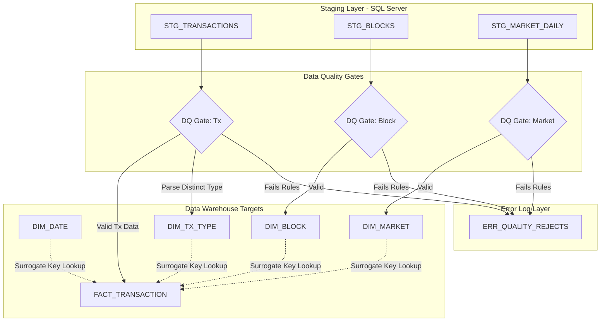

# Bitcoin Data Warehouse: Stage 2 Dimensional Model & ETL Design

## 1. Business Scope & Analytical Questions

### 1.1 Business Process Focus
- **Business Process**: Bitcoin Transaction Settlement  
- **Grain**: One confirmed on-chain transaction (one row in `FACT_TRANSACTION`)  
- **Trigger**: Block confirmation (~every 10 minutes)  
- **Primary User Profile**: **Blockchain Analyst / Researcher** — Centered entirely on on-chain network transaction settlement dynamics, efficiency patterns, fee pressure, script adoption, and macro-financial correlations.

---

### 1.2 Retained & Renumbered Analytical Questions (Q1–Q8)
Below are the 8 analytical questions identified in Stage 1, renumbered and structured in pure business terms with a description of how they support the decision-making of the **Blockchain Analyst**:

1. **Q1: What is the adoption rate of SegWit-native script types (P2WPKH, P2WSH, P2TR) versus legacy script types (P2PKH, P2SH) over time, and how has this composition evolved by quarter?**
   - *Usage / Impact*: Allows the analyst to track the adoption curve of network protocol upgrades. It helps wallet developers, businesses, and miners optimize fees by showing which transaction types dominate and when SegWit adoption triggers transaction throughput increases.
2. **Q2: Under what conditions of network congestion (measured by average transaction weight and size per block) do transaction fee rates (Satoshi per vByte) spike, and how do fee rates correlate with daily market price trends?**
   - *Usage / Impact*: Informs wallet developers and large payment processors (exchanges, custodians) on when to execute batching or utilize Lightning Network channels, saving thousands of dollars in fee volatility.
3. **Q3: What is the distribution of transaction fee burden (transaction fee in USD as a percentage of total transaction output value in USD) across different transaction size tiers?**
   - *Usage / Impact*: Critical for examining network utility and cost-efficiency. It reveals whether Bitcoin is being used primarily as a high-value settlement layer or a low-value transfer system, showing the economic viability of small-scale on-chain transfers.
4. **Q4: How does the transaction volume and total settlement value in fiat (USD) correlate with the daily Fear & Greed Index score? Are "Greed" periods accompanied by larger transaction values?**
   - *Usage / Impact*: Combines on-chain activity with market psychology to help macro researchers, fund managers, and behavioral analysts identify market tops/bottoms, transaction momentum shifts, and retail vs. institutional activity.
5. **Q5: What proportion of transactions use multiple inputs (indicating address consolidation or complex spending) versus single inputs, and how does this vary across legacy vs. SegWit transaction types?**
   - *Usage / Impact*: Helps privacy researchers and security analysts evaluate the efficacy of heuristic-based cluster analysis, address linking, and the prevalence of CoinJoin or wallet consolidation activities on-chain.
6. **Q6: How have transaction counts and average transaction sizes in vBytes evolved across different block height ranges (eras) corresponding to halving cycles?**
   - *Usage / Impact*: Essential for protocol scaling researchers and miners to evaluate block space utilization trends, transaction density improvements, and the structural impact of halving events on block-level metrics.
7. **Q7: What is the proportion of coinbase transactions (miner payouts) compared to standard transactions in terms of count and output value, and how does this composition change across halving eras?**
   - *Usage / Impact*: Tracks miner behavior, payout consolidation, and the gradual dilution of newly minted supply. It helps researchers model miner sell pressure and the long-term transition from block rewards to a transaction fee-only security model.
8. **Q8: How does the ratio of daily transaction settlement value in USD to Bitcoin's total daily market capitalization (NVT Ratio trend) behave during neutral versus extreme market sentiment days?**
   - *Usage / Impact*: A core valuation metric (Network Value to Transactions). By evaluating the NVT Ratio across market sentiment stages (Fear/Greed), analysts can detect asset overvaluation or undervaluation relative to the actual utility (on-chain settlement) of the network.

---

## 2. Dimensional Bus Matrix

The Dimensional Bus Matrix establishes our conformed data architecture. It shows how our single business process shares standard dimensions, paving the way for multi-dimensional data consistency.

| Business Process (Fact Table) | DIM_DATE (Conformed) | DIM_BLOCK (Conformed) | DIM_TX_TYPE (Conformed) | DIM_MARKET (Conformed) |
|:------------------------------|:--------------------:|:---------------------:|:-----------------------:|:----------------------:|
| **Bitcoin Transaction Settlement** (`FACT_TRANSACTION`) | **X** | **X** | **X** | **X** |

---

## 3. Slowly Changing Dimensions & Auditing Blueprint

### 3.1 SCD Strategies

> **SCD Type 0 vs Type 1 distinction**: *Type 0 (Fixed / Retain Original)* means the attribute is written once at insert and ETL will **never update it**, even if a discrepancy is detected in a later source load — the original value is the truth by definition. *Type 1 (Overwrite)* means ETL will silently replace the old value with the new one, keeping no history. Both leave no historical trail, but Type 0 signals intent: the value is structurally immutable, not merely treated as current.

- **`DIM_DATE`**: **SCD Type 0** (Fixed). Dates and their derived calendar attributes are structurally immutable — a given calendar date will never have a different year, quarter, or halving era. The ETL writes each date row once and must never update it; any incoming discrepancy indicates a source or pipeline defect, not a legitimate change.
- **`DIM_BLOCK`**: **SCD Type 0** (Fixed). A mined Bitcoin block's consensus attributes (hash, height, size, weight, difficulty) are cryptographically sealed by Proof-of-Work and permanently immutable once confirmed on-chain. No ETL process should ever overwrite them; a detected difference signals data corruption or a source error requiring investigation.
- **`DIM_TX_TYPE`**: **SCD Type 1** (Overwrite). Transaction script and flag classifications may need correction if a parsing rule is refined (e.g., a new script type is reclassified). There is no analytical need to preserve the prior label, so silent overwrite is acceptable.
- **`DIM_MARKET`**: **SCD Type 1** (Overwrite). While each row represents a fixed daily snapshot, preliminary intra-day values (e.g., an early-day Fear & Greed score or a partially settled market cap) may be refreshed once the full-day data is available. The final end-of-day value overwrites any earlier partial load for that date.

### 3.2 Auditing & Load Metadata
To ensure complete transparency and data lineage, every table in our dimensional schema includes two auditing metadata fields:
- **`dw_load_timestamp`** (`DATETIME`): Captures the exact system timestamp when the record was processed and loaded into the DW.
- **`dw_source_system`** (`VARCHAR`): Captures the originating source (e.g., `'API_YahooFinance'`, `'API_AlternativeMe'`, `'RPC_Bitcoind_Node'`) for debugging and traceback.

---

## 4. Detailed Dimensional Schema Specifications

### 4.1 Dimension Tables

#### 1. `DIM_DATE`
- **Grain**: One calendar day.
- **Auditing Columns**: Included.

| Column Name | Data Type | Key Type | SCD | Business Description |
|:------------|:----------|:--------:|:---:|:---------------------|
| `date_key` | `INT` | `PK` | `Type 0` | Surrogate Key representing Date (Format: `YYYYMMDD`) |
| `date` | `DATE` | - | `Type 0` | Actual calendar date |
| `day` | `TINYINT` | - | `Type 0` | Day of the month (1–31) |
| `month` | `TINYINT` | - | `Type 0` | Month of the year (1–12) |
| `quarter` | `TINYINT` | - | `Type 0` | Calendar quarter (1–4) |
| `year` | `INT` | - | `Type 0` | Calendar year (e.g., 2026) |
| `day_of_week` | `TINYINT` | - | `Type 0` | Day index (1 = Sunday, 7 = Saturday) |
| `is_weekend` | `TINYINT` | - | `Type 0` | Flag (1 = Weekend, 0 = Weekday) |
| `halving_era` | `VARCHAR(20)` | - | `Type 0` | Bitcoin halving epoch (e.g., `'Era 4'`, `'Era 5'`) |
| `dw_load_timestamp` | `DATETIME` | - | - | Loading system timestamp |
| `dw_source_system` | `VARCHAR(50)`| - | - | Source identifier (e.g., `'System_Calendar'`) |

#### 2. `DIM_BLOCK`
- **Grain**: One mined Bitcoin block.
- **Auditing Columns**: Included.

| Column Name | Data Type | Key Type | SCD | Business Description |
|:------------|:----------|:--------:|:---:|:---------------------|
| `block_key` | `INT` | `PK` | `Type 0` | Surrogate Key for block dimension |
| `block_height` | `INT` | - | `Type 0` | Bitcoin block height (Natural business key) |
| `block_hash` | `VARCHAR(64)`| - | `Type 0` | Unique SHA-256 block hash |
| `block_timestamp`| `DATETIME` | - | `Type 0` | Mined block header timestamp |
| `block_size_bytes`| `INT` | - | `Type 0` | Raw size of the block in bytes |
| `block_weight_units`| `INT` | - | `Type 0` | Weight of the block in Weight Units (max 4,000,000) |
| `block_difficulty`| `FLOAT` | - | `Type 0` | Proof-of-Work difficulty target at block mining |
| `difficulty_tier` | `VARCHAR(20)`| - | `Type 0` | Classification (e.g., `'Low'`, `'Medium'`, `'High'`, `'Extreme'`) |
| `dw_load_timestamp` | `DATETIME` | - | - | Loading system timestamp |
| `dw_source_system` | `VARCHAR(50)`| - | - | Source identifier (e.g., `'RPC_Bitcoind_Node'`) |

#### 3. `DIM_TX_TYPE`
- **Grain**: Unique combination of transaction script and operational flags.
- **Auditing Columns**: Included.

| Column Name | Data Type | Key Type | SCD | Business Description |
|:------------|:----------|:--------:|:---:|:---------------------|
| `tx_type_key` | `INT` | `PK` | `Type 1` | Surrogate Key for transaction script types |
| `script_type_desc`| `VARCHAR(20)`| - | `Type 1` | Dominant script type (e.g., `'P2PKH'`, `'P2SH'`, `'P2WPKH'`, `'P2TR'`) |
| `segwit_flag` | `TINYINT` | - | `Type 1` | SegWit indicator (1 = SegWit, 0 = Legacy) |
| `coinbase_flag` | `TINYINT` | - | `Type 1` | Miner payout indicator (1 = Coinbase, 0 = Standard) |
| `rbf_flag` | `TINYINT` | - | `Type 1` | Replace-By-Fee enabled indicator (1 = Enabled, 0 = Disabled) |
| `locktime_flag` | `TINYINT` | - | `Type 1` | Time-locked transaction indicator (1 = Locktime > 0, 0 = No) |
| `dw_load_timestamp` | `DATETIME` | - | - | Loading system timestamp |
| `dw_source_system` | `VARCHAR(50)`| - | - | Source identifier (e.g., `'Ingestion_Parser'`) |

#### 4. `DIM_MARKET`
- **Grain**: One daily macro market and sentiment snapshot.
- **Auditing Columns**: Included.
- **Uniqueness constraint**: `snapshot_date` carries a `UNIQUE` constraint enforced at the database level (`UNIQUE (snapshot_date)`). This guarantees that at most one market snapshot row can exist per calendar date, preventing silent duplication when two independent market data sources produce the same date's indicators simultaneously or when an incremental load re-processes an already-loaded day. Because all market signals (Fear & Greed score, BTC dominance, volatility) are defined as single daily values, a second row for the same date would be logically inconsistent and would distort any aggregation that counts or averages `market_key` lookups across the fact table.

| Column Name | Data Type | Key Type | SCD | Business Description |
|:------------|:----------|:--------:|:---:|:---------------------|
| `market_key` | `INT` | `PK` | `Type 1` | Surrogate Key for daily market snapshot |
| `snapshot_date` | `DATE` | `UNIQUE` | `Type 1` | Calendar date this snapshot covers — natural business key; `UNIQUE` constraint prevents duplicate daily rows |
| `fear_greed_score`| `TINYINT` | - | `Type 1` | Sentiment index score (0–100) |
| `fear_greed_label`| `VARCHAR(20)`| - | `Type 1` | Sentiment category (Extreme Fear / Neutral / Greed, etc.) |
| `btc_dominance_percent`| `FLOAT` | - | `Type 1` | Bitcoin's % share of total cryptocurrency market cap |
| `market_cap_usd` | `NUMERIC(24,4)`| - | `Type 1` | Bitcoin circulating market capitalization in fiat USD |
| `volatility_index`| `FLOAT` | - | `Type 1` | Rolling volatility score computed from average price |
| `dw_load_timestamp` | `DATETIME` | - | - | Loading system timestamp |
| `dw_source_system` | `VARCHAR(50)`| - | - | Source identifier (e.g., `'API_Yahoo_FearGreed'`) |

---

### 4.2 Fact Table: `FACT_TRANSACTION`
- **Grain**: One confirmed on-chain Bitcoin transaction.
- **Auditing Columns**: Included.

> **Design rationale — pre-computed columns**: Storage in a column-store or row-store analytical DB is cheap; CPU time spent recomputing the same derived expressions across tens of millions of rows at query runtime is not. The six columns marked `[pre-computed]` below are deterministic functions of other columns already in the row. They are calculated once during ETL and stored, so OLAP queries, SSAS calculated measures, and Tableau/Power BI formulas can read them directly rather than re-deriving them on every scan. This is especially relevant for `fee_burden_pct` (needed by Q3 on every row), `tx_vsize_bytes` (the industry-standard unit for fee analysis, needed by Q2), and the BTC-denominated triplet (avoids repeated `/1e8` division in every client tool).

| Column Name | Data Type | Key Type | Business Description |
|:------------|:----------|:--------:|:---------------------|
| `tx_key` | `BIGINT` | `PK` | Surrogate Key for transactions (loaded sequentially) |
| `date_key` | `INT` | `FK` | Links to `DIM_DATE` |
| `block_key` | `INT` | `FK` | Links to `DIM_BLOCK` |
| `tx_type_key` | `INT` | `FK` | Links to `DIM_TX_TYPE` |
| `market_key` | `INT` | `FK` | Links to `DIM_MARKET` |
| `txid` | `VARCHAR(64)` | - | Unique SHA-256 transaction identifier (Business key) |
| `fee_satoshis` | `BIGINT` | - | On-chain fee paid in Satoshis |
| `fee_rate_sat_vbyte`| `FLOAT` | - | Fee rate paid per virtual byte (Satoshis/vByte) |
| `input_value_sat` | `BIGINT` | - | Cumulative input addresses value in Satoshis |
| `output_value_sat`| `BIGINT` | - | Cumulative output addresses value in Satoshis |
| `tx_size_bytes` | `INT` | - | Transaction size in raw bytes |
| `tx_weight_units` | `INT` | - | Transaction weight in weight units |
| `btc_price_usd_avg`| `NUMERIC(18,4)`| - | Conformed daily average Bitcoin price (USD) |
| `input_value_usd` | `NUMERIC(20,4)`| - | Fiat transaction input value in USD (calculated) |
| `output_value_usd`| `NUMERIC(20,4)`| - | Fiat transaction output value in USD (calculated) |
| `fee_usd` | `NUMERIC(18,4)`| - | Fiat transaction fee in USD (calculated) |
| `market_cap_usd` | `NUMERIC(24,4)`| - | Daily Bitcoin circulating market cap (macro correlation) |
| `fear_greed_score`| `TINYINT` | - | Daily Fear & Greed index score (macro correlation) |
| `tx_vsize_bytes` | `NUMERIC(10,2)` | - | **[pre-computed]** Virtual size in vBytes: `tx_weight_units / 4.0`. The canonical fee-analysis unit (SegWit discount applied); avoids repeated division in every fee-rate query (Q2, Q3). |
| `fee_burden_pct` | `NUMERIC(10,4)` | - | **[pre-computed]** Fee as % of output value: `fee_satoshis * 100.0 / NULLIF(output_value_sat, 0)`. Directly answers Q3 without runtime division across 50 M rows; NULL-safe for coinbase transactions. |
| `input_value_btc` | `NUMERIC(18,8)` | - | **[pre-computed]** Input value in BTC: `input_value_sat / 100000000.0`. Eliminates per-query `/1e8` conversion in Tableau / SSAS calculated members. |
| `output_value_btc`| `NUMERIC(18,8)` | - | **[pre-computed]** Output value in BTC: `output_value_sat / 100000000.0`. Paired with `input_value_btc` for BTC-denominated volume analysis. |
| `fee_btc` | `NUMERIC(18,8)` | - | **[pre-computed]** Fee in BTC: `fee_satoshis / 100000000.0`. Enables direct BTC fee aggregation without satoshi-to-BTC conversion at runtime. |
| `io_value_ratio` | `NUMERIC(10,4)` | - | **[pre-computed]** Input-to-output value ratio: `input_value_sat * 1.0 / NULLIF(output_value_sat, 0)`. Values > 1 reflect fee burn; high ratios flag batch consolidation or high-fee transactions; supports Q5 UTXO clustering analysis. |
| `dw_load_timestamp`| `DATETIME` | - | Timestamp when the transaction was loaded into DW |
| `dw_source_system` | `VARCHAR(50)` | - | Source identifier (e.g., `'RPC_Node_YahooFinance'`) |

---

## 5. Logical Data Map — `DIM_TX_TYPE`

The detailed logical data map maps our conformed dimension `DIM_TX_TYPE` from its raw source elements.

- **Target Table**: `DIM_TX_TYPE`

| Target Attribute | Target Data Type | Source System/Table | Source Attribute | Transformation Logic / Rule |
|:-----------------|:-----------------|:--------------------|:-----------------|:----------------------------|
| `tx_type_key` | `INT` | Staging (DW) | - | Surrogate Key, generated via auto-increment (`IDENTITY(1,1)`) |
| `script_type_desc`| `VARCHAR(20)` | `STG_TRANSACTIONS` | `dominant_script_type` | If NULL, map to `'OTHER'`. Clean whitespace and cast to uppercase. |
| `segwit_flag` | `TINYINT` | `STG_TRANSACTIONS` | `is_segwit` | Convert boolean to `TINYINT`: `CASE WHEN is_segwit = 1 THEN 1 ELSE 0 END` |
| `coinbase_flag` | `TINYINT` | `STG_TRANSACTIONS` | `is_coinbase` | Convert boolean to `TINYINT`: `CASE WHEN is_coinbase = 1 THEN 1 ELSE 0 END` |
| `rbf_flag` | `TINYINT` | `STG_TRANSACTIONS` | `rbf_enabled` | Convert boolean to `TINYINT`: `CASE WHEN rbf_enabled = 1 THEN 1 ELSE 0 END` |
| `locktime_flag` | `TINYINT` | `STG_TRANSACTIONS` | `locktime` | Flag presence of Locktime: `CASE WHEN locktime > 0 THEN 1 ELSE 0 END` |
| `dw_load_timestamp`| `DATETIME` | ETL Engine | - | Insert execution timestamp: `GETDATE()` |
| `dw_source_system`| `VARCHAR(50)` | ETL Engine | - | Hardcoded audit identifier: `'STG_TRANSACTIONS'` |

---

## 6. Data Quality (DQ) Specification — 4 Pillars

Data Quality Gates are placed between the Staging database and the Dimensional target tables. Records failing validations are written to an **Error Reject Table** (`ERR_QUALITY_REJECTS`) for manual analysis, preserving target integrity.

| Dimension / Fact | Attribute | DQ Pillar | DQ Rule | Corrective Action if Violated |
|:-----------------|:----------|:---------:|:--------|:------------------------------|
| `FACT_TRANSACTION`| `txid` | **Uniqueness** | Must be unique and follow a 64-char hex format. | Reject record, insert into `ERR_QUALITY_REJECTS`, flag log warning. |
| `FACT_TRANSACTION`| `output_value_sat`| **Completeness**| Value cannot be NULL or negative (must be >= 0). | Reject record, insert into `ERR_QUALITY_REJECTS`. |
| `DIM_TX_TYPE` | `script_type_desc`| **Consistency**| Must match conformed list: `'P2PKH'`, `'P2SH'`, `'P2WPKH'`, `'P2WSH'`, `'P2TR'`, `'OTHER'`. | Map to `'OTHER'`, log discrepancy, continue loading. |
| `DIM_MARKET` | `date` | **Freshness** | Date must represent a snapshot from the last 24 hours relative to load. | Send automated alert to operations team; insert default values. |
| `DIM_BLOCK` | `block_hash` | **Completeness**| Cannot be NULL and must be exactly 64 characters long. | Reject block record and all child transactions in load batch. |

---

## 7. High-Level ETL Maps & Data Quality Flow

### 7.1 Visual ETL Flow Diagram

### 7.2 Core ETL Mapping Logic
1. **Dimension Loading**:
   - **`DIM_DATE`**: Populated statically or dynamically via calendar generators. Key logic generates the `YYYYMMDD` integer surrogate key.
   - **`DIM_BLOCK`**: Mapped from `STG_BLOCKS` passing the DQ Gate. Height serves as the business key; `difficulty_tier` is assigned via ranges during loading.
   - **`DIM_TX_TYPE`**: Mapped dynamically from distinct operational flags parsed from `STG_TRANSACTIONS`. Unknown script variations default to `'OTHER'`.
   - **`DIM_MARKET`**: Incremental daily loads from `STG_MARKET_DAILY` matching calendar dates. Price index values are standardized and validated.
2. **Fact Table Loading (`FACT_TRANSACTION`)**:
   - For each valid transaction record in staging:
     - **Surrogate Key Lookups**: Query conformed dimension tables (`DIM_DATE`, `DIM_BLOCK`, `DIM_TX_TYPE`, `DIM_MARKET`) to retrieve their respective `date_key`, `block_key`, `tx_type_key`, and `market_key` corresponding to the transaction date, block height, parsing properties, and execution day.
     - **Value Transformations**: Multiply Satoshi metrics by the conformed daily average price (`btc_price_usd_avg`) divided by `10^8` to dynamically calculate `input_value_usd`, `output_value_usd`, and `fee_usd`.
     - **Audit Metadata**: Assign loading timestamp (`GETDATE()`) and source name (`'STG_TRANSACTIONS'`).
